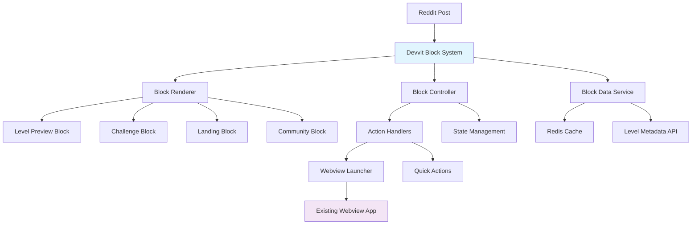

# Design Document

## Overview

The devvit block system will replace the current splash screen approach with interactive Reddit-native blocks that display before users enter the full webview experience. This system follows the Pixelary pattern of showing engaging preview content directly within Reddit posts, allowing users to interact with game content without leaving the Reddit interface.

The design leverages devvit's custom post capabilities to render interactive UI components that can display level previews, game statistics, and provide quick actions. The system will maintain the existing webview architecture while adding a new presentation layer that enhances discoverability and engagement.

## Architecture

### High-Level Architecture



### Component Architecture

The block system consists of three main layers:

1. **Presentation Layer**: Devvit UI blocks that render within Reddit posts
2. **Controller Layer**: Handles user interactions and state management
3. **Data Layer**: Manages block content and integrates with existing APIs

### Integration Points

- **Existing Post Creation**: Extends current `createPost`, `createLevelPost`, etc. functions
- **Webview Transition**: Maintains context when launching the full app
- **API Compatibility**: Uses existing server endpoints for data consistency
- **Redis Integration**: Leverages current caching infrastructure

## Components and Interfaces

### Block Types

#### 1. Level Preview Block

Displays published level information in a card format similar to Pixelary.

**Properties:**

- Level title and creator
- Difficulty indicator with visual styling
- Play count and rating
- Thumbnail preview (if available)
- "Play Now" and "View Details" actions

#### 2. Weekly Challenge Block

Shows current challenge information and leaderboard preview.

**Properties:**

- Challenge week identifier
- Seed-based level preview
- Top 3 leaderboard entries
- Time remaining indicator
- "Join Challenge" action

#### 3. Landing Block

Promotes the app with feature highlights and community content.

**Properties:**

- App description and features
- Recent community highlights
- Getting started actions
- Featured level carousel

#### 4. Community Showcase Block

Displays community statistics and featured content.

**Properties:**

- Total levels created
- Active players count
- Featured creators
- Recent popular levels

### Core Interfaces

```typescript
// Block configuration interface
interface BlockConfig {
  type: 'level-preview' | 'weekly-challenge' | 'landing' | 'community-showcase';
  postId: string;
  data: BlockData;
  actions: BlockAction[];
}

// Block data union type
type BlockData = LevelBlockData | ChallengeBlockData | LandingBlockData | CommunityBlockData;

// Level block specific data
interface LevelBlockData {
  levelId: string;
  title: string;
  creator: string;
  difficulty: number;
  playCount: number;
  rating?: number;
  thumbnailUrl?: string;
  description?: string;
}

// Block action interface
interface BlockAction {
  id: string;
  label: string;
  type: 'primary' | 'secondary';
  handler: string; // Handler function name
  requiresAuth?: boolean;
}

// Block state management
interface BlockState {
  loading: boolean;
  error?: string;
  data?: BlockData;
  userInteracted: boolean;
}
```

### Devvit Block Components

#### Base Block Component

```typescript
// Devvit block base structure
const BaseBlock = (config: BlockConfig) => {
  return (
    <vstack padding="medium" cornerRadius="medium" backgroundColor="neutral-background">
      <BlockHeader config={config} />
      <BlockContent config={config} />
      <BlockActions config={config} />
    </vstack>
  );
};
```

#### Level Preview Block Component

```typescript
const LevelPreviewBlock = (data: LevelBlockData) => {
  return (
    <vstack gap="small">
      {/* Header with title and creator */}
      <hstack alignment="space-between">
        <vstack gap="none">
          <text size="large" weight="bold">{data.title}</text>
          <text size="small" color="secondary">by u/{data.creator}</text>
        </vstack>
        <DifficultyIndicator level={data.difficulty} />
      </hstack>

      {/* Thumbnail and stats */}
      <hstack gap="medium">
        {data.thumbnailUrl && (
          <image url={data.thumbnailUrl} width={80} height={60} />
        )}
        <vstack gap="small">
          <text size="small">Plays: {data.playCount}</text>
          {data.rating && <text size="small">Rating: {data.rating}/5</text>}
        </vstack>
      </hstack>

      {/* Description */}
      {data.description && (
        <text size="medium" color="secondary" maxLines={2}>
          {data.description}
        </text>
      )}
    </vstack>
  );
};
```

## Data Models

### Block Metadata Storage

```typescript
// Redis keys for block data
const BLOCK_KEYS = {
  LEVEL_METADATA: (postId: string) => `block:level:${postId}`,
  CHALLENGE_DATA: (weekId: string) => `block:challenge:${weekId}`,
  COMMUNITY_STATS: 'block:community:stats',
  USER_INTERACTIONS: (userId: string, postId: string) => `block:interaction:${userId}:${postId}`,
};

// Block metadata structure
interface BlockMetadata {
  postId: string;
  blockType: string;
  createdAt: number;
  lastUpdated: number;
  viewCount: number;
  interactionCount: number;
}
```

### Level Block Data Extension

Extends existing level data with block-specific metadata:

```typescript
interface LevelBlockMetadata extends LevelMetadata {
  // Block-specific additions
  thumbnailUrl?: string;
  shortDescription?: string;
  playCount: number;
  averageRating?: number;
  lastPlayedAt?: number;

  // Visual customization
  cardColor?: string;
  badgeText?: string;
  featured: boolean;
}
```

## Error Handling

### Block Loading Errors

1. **Data Fetch Failures**: Display cached content with refresh option
2. **Authentication Errors**: Show login prompt for protected actions
3. **Network Timeouts**: Graceful degradation with basic information
4. **Invalid Block Configuration**: Fallback to generic game preview

### Error Recovery Strategies

```typescript
interface ErrorHandlingStrategy {
  // Retry mechanism for transient failures
  retryAttempts: number;
  retryDelay: number;

  // Fallback content for critical failures
  fallbackContent: BlockData;

  // User notification approach
  errorDisplay: 'toast' | 'inline' | 'modal';
}
```

### Error States

- **Loading State**: Skeleton UI with loading indicators
- **Error State**: Error message with retry action
- **Empty State**: Placeholder content with creation prompts
- **Offline State**: Cached content with sync indicators

## Testing Strategy

### Unit Testing

1. **Block Component Tests**

   - Render testing for all block types
   - Props validation and default handling
   - Action handler invocation
   - State management verification

2. **Data Service Tests**
   - API integration testing
   - Cache behavior validation
   - Error handling verification
   - Performance benchmarking

### Integration Testing

1. **Block-to-Webview Transition**

   - Context preservation testing
   - State synchronization validation
   - Performance impact measurement

2. **Reddit Integration**
   - Post creation with blocks
   - User interaction tracking
   - Authentication flow testing

### Visual Testing

1. **Block Appearance**

   - Cross-platform rendering consistency
   - Responsive design validation
   - Accessibility compliance testing

2. **User Experience**
   - Interaction responsiveness
   - Loading state transitions
   - Error state handling

### Performance Testing

1. **Load Time Optimization**

   - Block render performance
   - Data fetch optimization
   - Cache effectiveness measurement

2. **Scalability Testing**
   - Multiple blocks per page
   - High traffic scenarios
   - Memory usage monitoring

## Implementation Phases

### Phase 1: Core Infrastructure

- Block system architecture setup
- Base block components
- Data service integration
- Basic level preview block

### Phase 2: Block Types Implementation

- Weekly challenge blocks
- Landing page blocks
- Community showcase blocks
- Action handlers and navigation

### Phase 3: Enhanced Features

- Thumbnail generation and caching
- Advanced user interactions
- Performance optimizations
- Analytics integration

### Phase 4: Polish and Optimization

- Visual refinements
- Accessibility improvements
- Performance tuning
- Comprehensive testing
