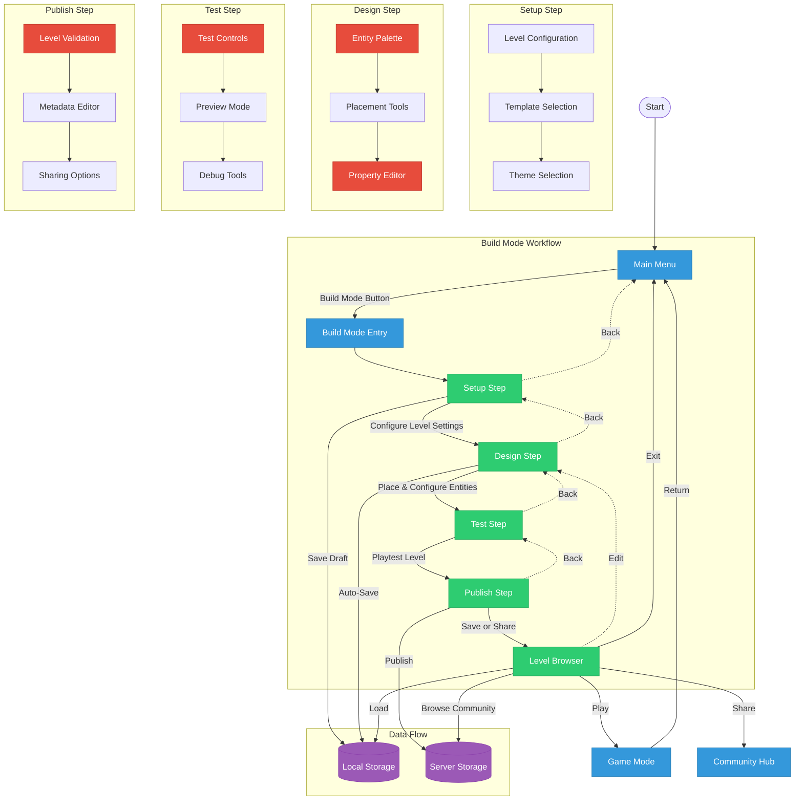

```mermaid
flowchart TD
    Start([Start]) --> MainMenu[Main Menu]
    MainMenu -->|Build Mode Button| BuildModeEntry[Build Mode Entry]
    
    subgraph "Build Mode Workflow"
        BuildModeEntry --> SetupStep[Setup Step]
        SetupStep -->|Configure Level Settings| DesignStep[Design Step]
        DesignStep -->|Place & Configure Entities| TestStep[Test Step]
        TestStep -->|Playtest Level| PublishStep[Publish Step]
        PublishStep -->|Save or Share| LevelBrowser[Level Browser]
        
        SetupStep -.->|Back| MainMenu
        DesignStep -.->|Back| SetupStep
        TestStep -.->|Back| DesignStep
        PublishStep -.->|Back| TestStep
        LevelBrowser -.->|Edit| DesignStep
    end
    
    LevelBrowser -->|Play| GamePlay[Game Mode]
    LevelBrowser -->|Share| Community[Community Hub]
    LevelBrowser -->|Exit| MainMenu
    GamePlay -->|Return| MainMenu
    
    subgraph "Data Flow"
        LocalStorage[(Local Storage)]
        ServerStorage[(Server Storage)]
        
        SetupStep -->|Save Draft| LocalStorage
        DesignStep -->|Auto-Save| LocalStorage
        PublishStep -->|Publish| ServerStorage
        LevelBrowser -->|Load| LocalStorage
        LevelBrowser -->|Browse Community| ServerStorage
    end
    
    subgraph "Setup Step"
        direction TB
        SetupConfig[Level Configuration]
        TemplateSelector[Template Selection]
        ThemeSelector[Theme Selection]
        SetupConfig --> TemplateSelector
        TemplateSelector --> ThemeSelector
    end
    
    subgraph "Design Step"
        direction TB
        EntityPalette[Entity Palette]
        PlacementTool[Placement Tools]
        PropertyEditor[Property Editor]
        EntityPalette --> PlacementTool
        PlacementTool --> PropertyEditor
    end
    
    subgraph "Test Step"
        direction TB
        TestControls[Test Controls]
        PreviewMode[Preview Mode]
        DebugTools[Debug Tools]
        TestControls --> PreviewMode
        PreviewMode --> DebugTools
    end
    
    subgraph "Publish Step"
        direction TB
        Validation[Level Validation]
        MetadataEditor[Metadata Editor]
        SharingOptions[Sharing Options]
        Validation --> MetadataEditor
        MetadataEditor --> SharingOptions
    end
    
    classDef primary fill:#3498db,stroke:#2980b9,color:white;
    classDef secondary fill:#2ecc71,stroke:#27ae60,color:white;
    classDef tertiary fill:#9b59b6,stroke:#8e44ad,color:white;
    classDef quaternary fill:#e74c3c,stroke:#c0392b,color:white;
    
    class MainMenu,BuildModeEntry,GamePlay,Community primary;
    class SetupStep,DesignStep,TestStep,PublishStep,LevelBrowser secondary;
    class LocalStorage,ServerStorage tertiary;
    class EntityPalette,PropertyEditor,TestControls,Validation quaternary;
```
